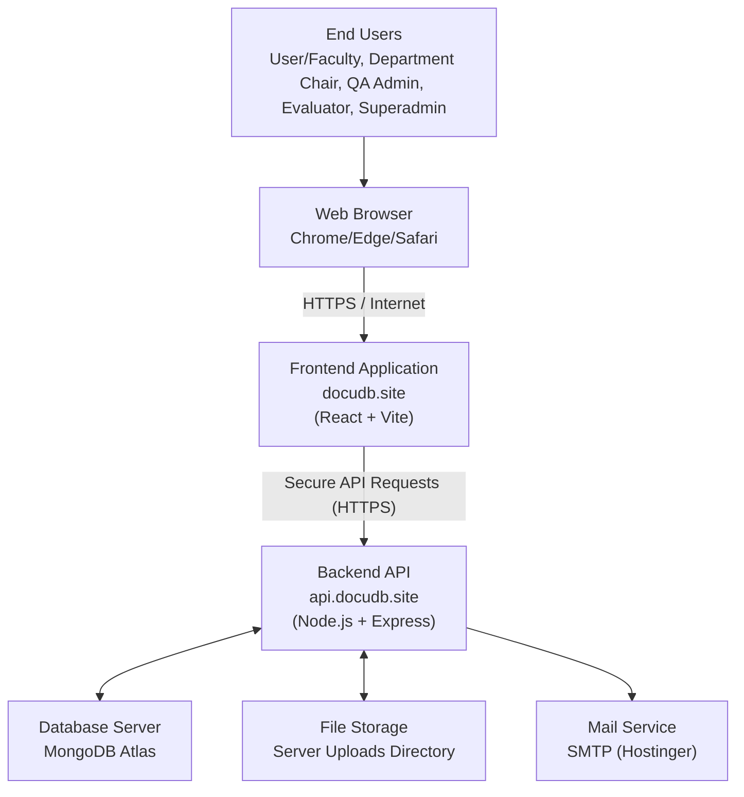

# Operational Environment

The deployment architecture of the DocuDB system illustrates the flow of data from end users to the production infrastructure, providing a clear view of the operational environment. This topology outlines the major infrastructure components that work together to ensure secure system accessibility, reliable COPC workflow execution, and consistent data availability.

**Figure 19: Deployment Topology and Operational Environment of DocuDB.**

The system is accessed by end users through standard web browsers on desktop or mobile devices. Client requests are transmitted via HTTPS over the Internet to the production frontend hosted at `docudb.site`. The frontend then communicates securely with the backend API at `api.docudb.site`, where application services handle authentication and role-based authorization, document and folder management, versioning, notifications, and COPC workflow processing. Persistent structured data is stored in MongoDB Atlas, while uploaded files are managed in the backend file storage directory. Email-based services such as OTP and notification delivery are handled through SMTP integration. This deployment configuration provides secure communication, scalable service separation between client and API layers, and reliable availability for daily institutional operations.
