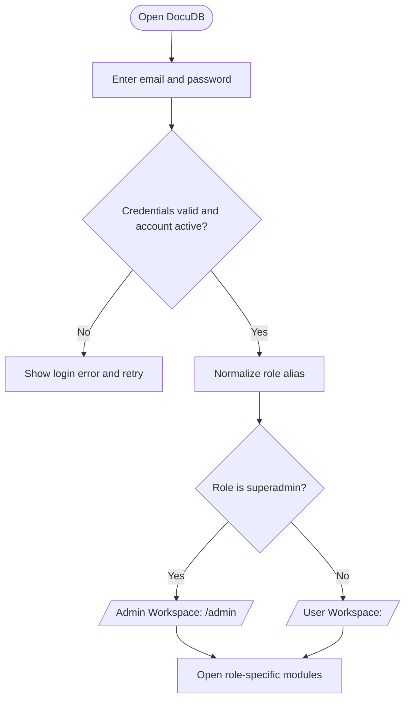
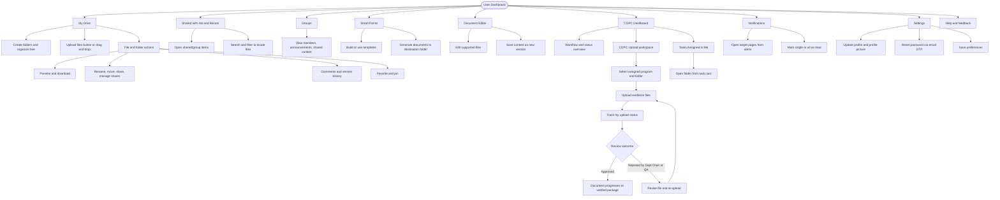
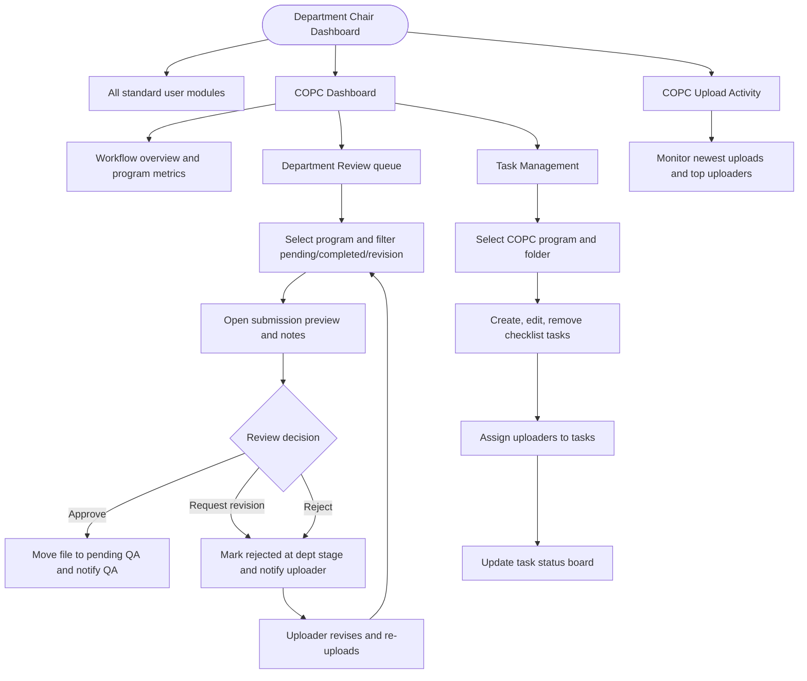
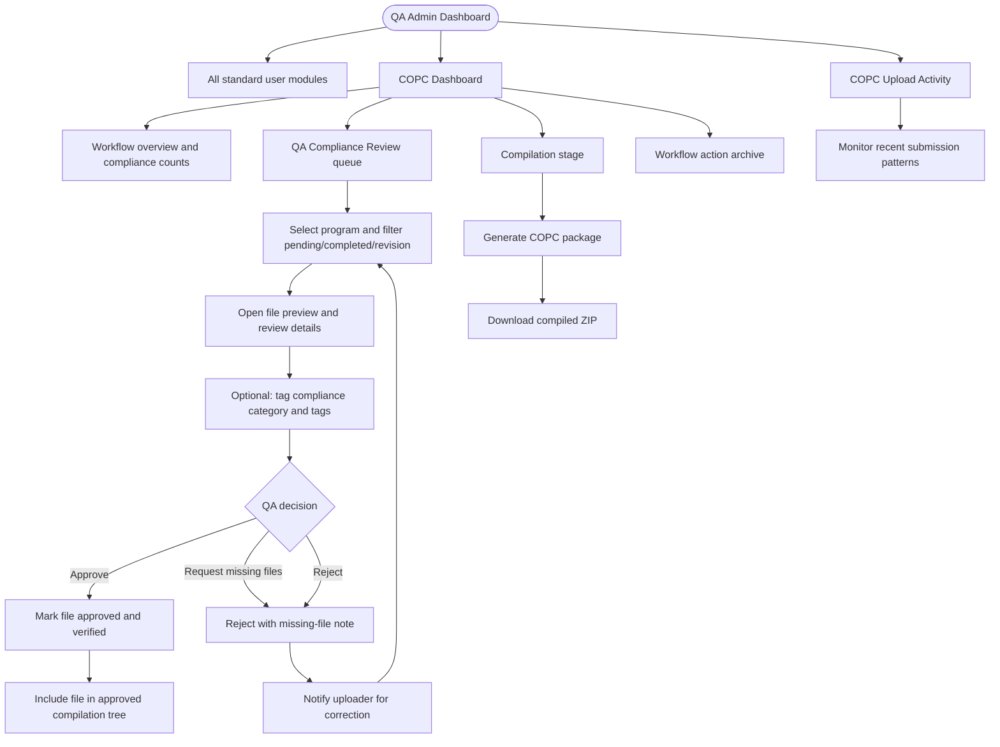
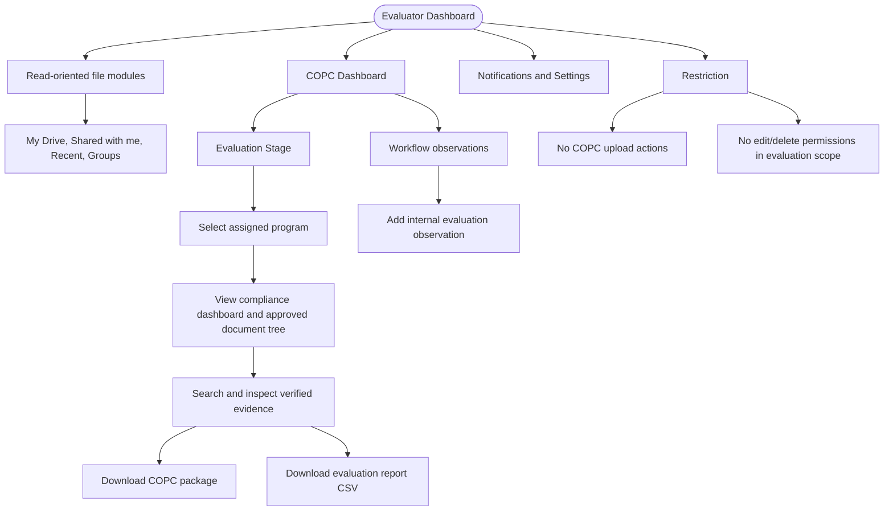
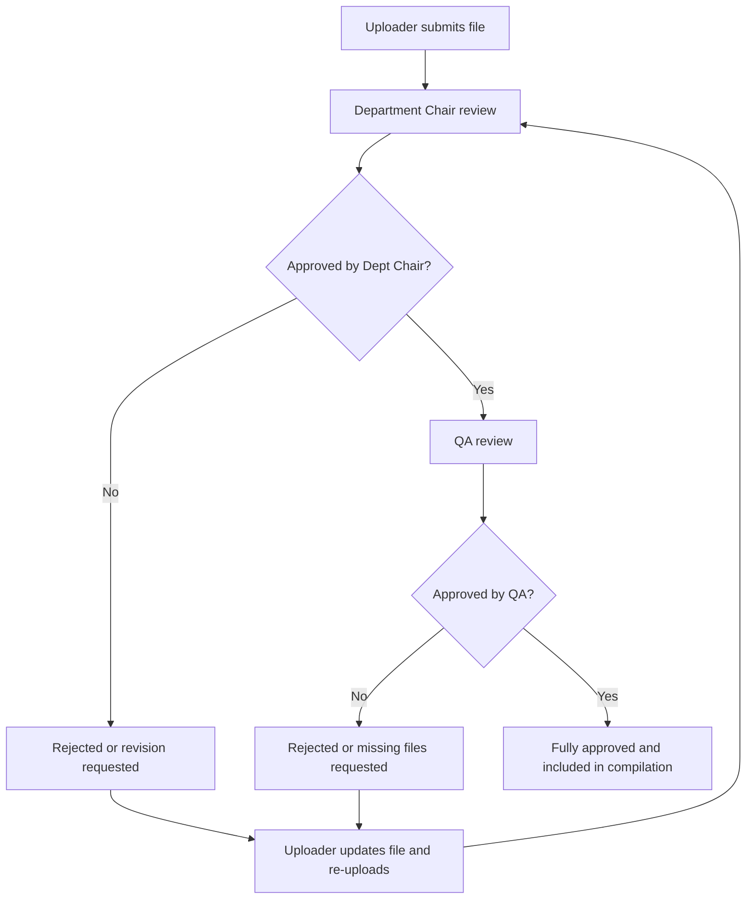
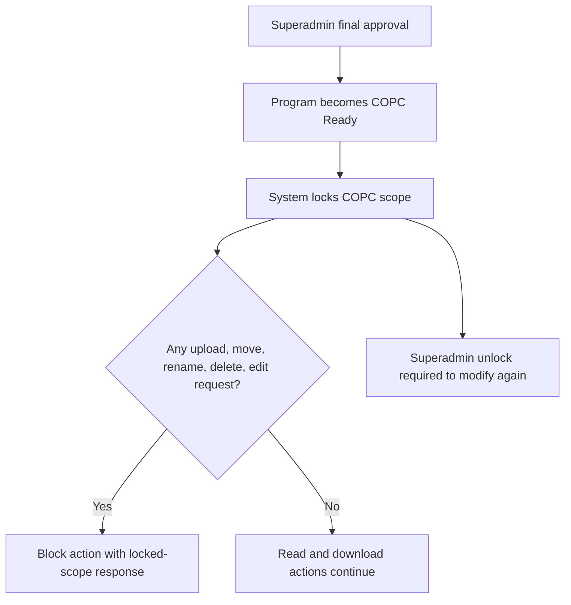
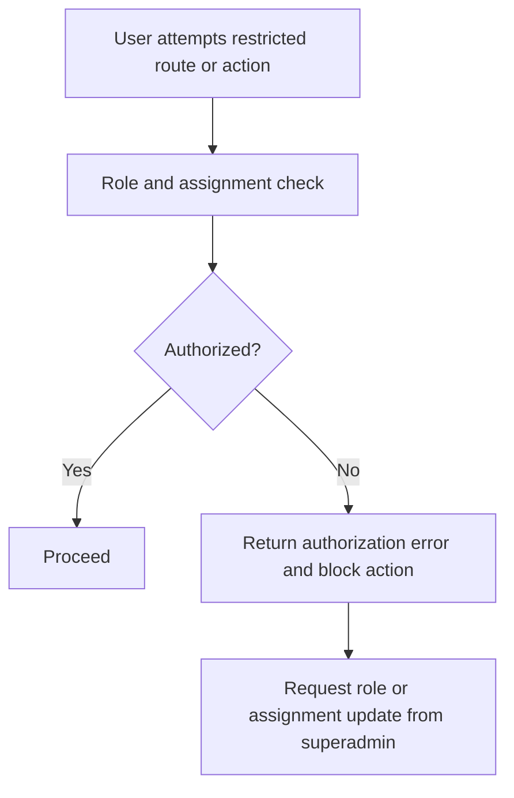

# DocuDB Complete Program Flow by Role (Feature-Based)

This document provides full role-based flowcharts based on the implemented frontend routes, role guards, and backend workflow permissions.

## 1. Common Authentication and Role Routing

Role aliases normalized by system:

- `admin` -> `superadmin`
- `faculty` -> `user`
- `program_chair`, `department_chair`, `program_head` -> `dept_chair`
- `qa_officer`, `quality_assurance_admin`, `copc_reviewer` -> `qa_admin`
- `reviewer` -> `evaluator`

## 2. User (`user`) Complete Feature Flow

## 3. Department Chair (`dept_chair`) Complete Feature Flow

## 4. QA Admin (`qa_admin`) Complete Feature Flow

## 5. Evaluator (`evaluator`) Complete Feature Flow

## 6. Superadmin (`superadmin`) Complete Feature Flow

```mermaid
flowchart TD
    A([Superadmin Admin Workspace]) --> B[System Governance]
    B --> B1[Manage Users]
    B1 --> B11[Create single users]
    B1 --> B12[Bulk import users]
    B1 --> B13[Edit profile and role]
    B1 --> B14[Activate or deactivate accounts]

    B --> B2[Group Administration]
    B2 --> B21[Create, edit, delete groups]
    B2 --> B22[Manage members and leaders]

    B --> B3[Admin Files]
    B3 --> B31[System-wide file and folder operations]

    B --> B4[Trash Management]
    B4 --> B41[Restore or permanently delete]

    B --> B5[System Logs and Admin Search]

    A --> C[COPC Lifecycle Control]
    C --> C1[Initialize COPC Program]
    C1 --> C11[Set code, name, description, year]

    C --> C2[Assign COPC Roles]
    C2 --> C21[Uploaders and uploader groups]
    C2 --> C22[Department chairs]
    C2 --> C23[QA admins]
    C2 --> C24[Evaluators]

    C --> C3[Workflow Monitoring]
    C3 --> C31[Submission tracker]
    C3 --> C32[Progress and compliance summary]

    C --> C4[Task Management]
    C4 --> C41[Create and edit folder tasks]
    C4 --> C42[Assign task uploaders]
    C4 --> C43[Track task board progress]

    C --> C5[Program Management]
    C5 --> C51[Edit program metadata]
    C5 --> C52[Lock and unlock scope]
    C5 --> C53[Archive program]
    C5 --> C54[Delete program workspace]

    C --> C6[Finalization]
    C6 --> C61[Compile package]
    C6 --> C62[Final approval]
    C62 --> C63[Auto-lock after COPC Ready]
    C63 --> C64[Download final package]

    A --> D[Archived Programs]
    D --> D1[Review archived records]
    D --> D2[Unarchive when needed]

    A --> E[Recent COPC Upload Monitoring]
```

## 7. Cross-Role Exception and Control Flows

### 7.1 Rejection and Revision Loop

### 7.2 Locked COPC Scope Path

### 7.3 Access Denied Path

## 8. Role-to-Feature Coverage Matrix

| Feature / Module | User | Dept Chair | QA Admin | Evaluator | Superadmin |
|---|---|---|---|---|---|
| My Drive core file and folder operations | Yes | Yes | Yes | Limited read | Yes |
| Shared with me and Recent | Yes | Yes | Yes | Yes | Yes |
| Groups collaboration | Yes | Yes | Yes | Yes | Admin + user-side |
| Smart Forms and document generation | Yes | Yes | Yes | Limited/optional | Yes |
| Document editor and version save | Yes | Yes | Yes | Limited read-only use | Yes |
| COPC workflow overview | Yes | Yes | Yes | Yes | Yes |
| COPC upload workspace | Yes | Yes | Yes | No | Via user-side route if needed |
| Tasks Assigned to Me | Yes | Yes | Yes | Yes | In user-context only |
| Task Management board | No | Yes | No | No | Yes |
| Department review queue | No | Yes | No | No | Yes |
| QA compliance review queue | No | No | Yes | No | Yes |
| Compliance tagging (QA) | No | No | Yes | No | Yes |
| Evaluation stage | No | No | No | Yes | Yes |
| Compile COPC package | No | No | Yes | No | Yes |
| Final approval (COPC Ready + lock) | No | No | No | No | Yes |
| Program lock/unlock, archive, delete, unarchive | No | No | Archive support only | No | Yes |
| COPC upload activity dashboard | No | Yes | Yes | No | Yes |
| Manage users and roles | No | No | No | No | Yes |
| Admin files, trash management, logs | No | No | No | No | Yes |
| Notifications | Yes | Yes | Yes | Yes | Yes |
| Settings (profile + OTP password reset) | Yes | Yes | Yes | Yes | Yes |

---

If you want, I can also generate a separate `.mmd` file version of each role diagram so you can export PNG/SVG directly for your documentation or defense slides.
