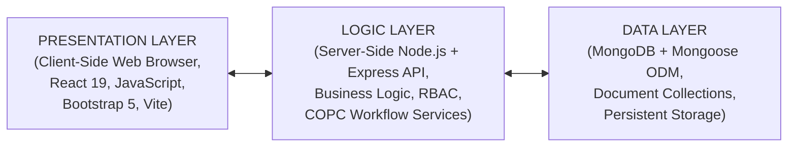

# Programming Environment

This section explains the programming environment, which is the collection of tools, frameworks, and systems used to develop, test, and run the DocuDB software. It covers key components such as the source-code editor, JavaScript runtime and package manager, API debugging tools, and database tooling, which together form the foundation for building and maintaining the system.

**Figure 17: Three-Tier Programming Environment of the DocuDB System.**

The implementation of the DocuDB system used a modern full-stack JavaScript programming environment to support maintainability, performance, and role-based institutional workflows. The Frontend/Presentation layer was developed using React 19, JavaScript, Vite, and Bootstrap 5 to deliver a responsive interface for faculty users, department chairs, QA admins, evaluators, and superadmins. The Backend/Logic layer was implemented using Node.js and Express.js, which handled core services such as authentication and authorization, file and folder operations, notifications, task tracking, and COPC workflow processing. For the Data layer, MongoDB with Mongoose ODM was used to manage structured document metadata, user and role records, version histories, and compliance workflow states. Development and testing were primarily performed in a local environment using Node.js, npm, MongoDB, and API testing tools, then prepared for staging and production hosting with domain-separated frontend and backend services.
