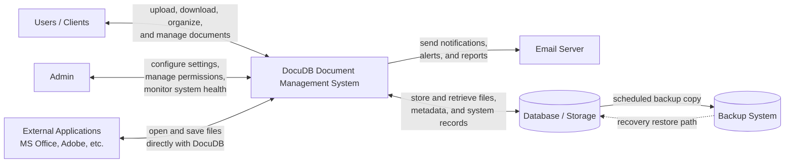

# System Context Diagram

## Context Entities (Formatted)

- **Users/Clients**: The primary actors who upload, download, and manage their documents within the system.
- **Admin**: Responsible for configuring system settings, managing user permissions, and monitoring overall system health.
- **External Applications**: Systems like MS Office or Adobe that interact with DocuDB to open or save files directly.
- **Email Server**: Handles the automated sending of notifications, alerts, and system reports to users and administrators.
- **Database/Storage**: The central repository where all document metadata and files are securely stored.
- **Backup System**: An independent process that regularly copies data from the Database/Storage to ensure data recovery in case of failure.

## Mermaid Source

